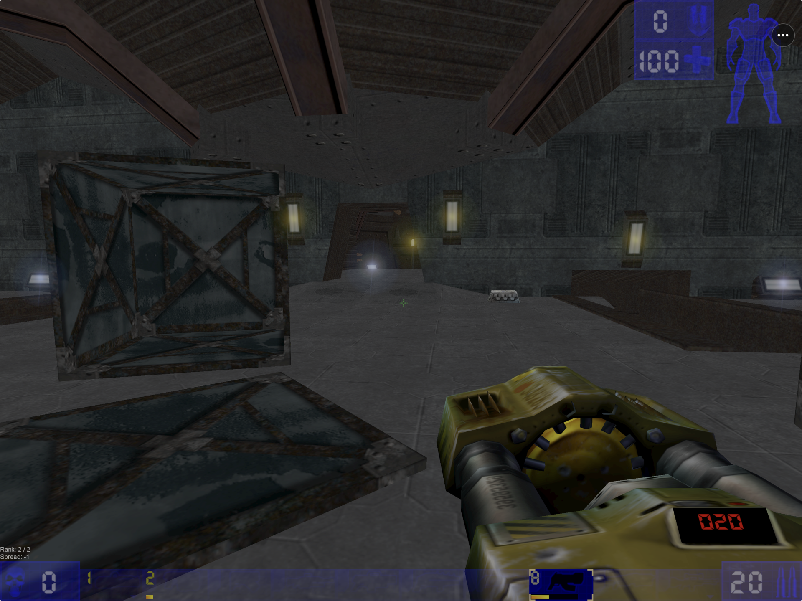
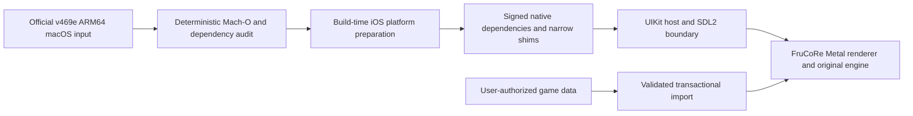
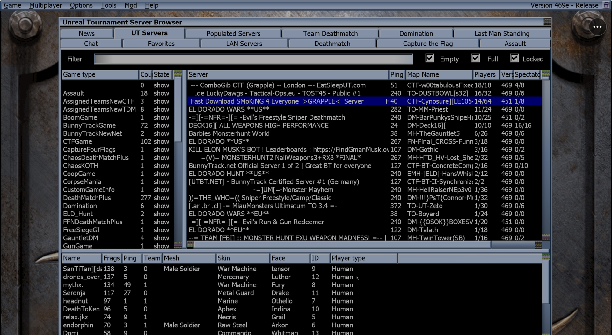

# UTP

<p align="center">
  <strong>Unreal Tournament 99 on iPhone and iPad.</strong><br>
  UTP hosts the original OldUnreal v469e game inside a native iOS app with
  Metal rendering, touch controls, game-file setup, and classic online play.
</p>

<p align="center">
  <a href="https://github.com/chrissotraidis/utp/actions/workflows/public-safety.yml"></a>
  
  
  
  <a href="https://github.com/chrissotraidis/utp/releases/tag/v0.1.0-preview.1"></a>
  
</p>



<p align="center"><em>Current UTP gameplay build, tested extensively on physical iPhone and iPad.</em></p>

<p align="center">
  <a href="#release-status">Status</a> ·
  <a href="#build-and-test">Build</a> ·
  <a href="#controls-and-input">Controls</a> ·
  <a href="#frequently-asked-questions">FAQ</a> ·
  <a href="docs/evidence/index.md">Evidence</a> ·
  <a href="https://github.com/chrissotraidis/utp/issues/new/choose">Report a problem</a>
</p>

UTP brings the original Unreal Tournament 99 engine to iPhone and iPad by
hosting the official
[OldUnreal v469e](https://github.com/OldUnreal/UnrealTournamentPatches/releases/tag/v469e)
ARM64 runtime inside a native iOS app. It is not streaming, emulation, or a
remake: the original game still owns its menus, maps, bots, weapons, rules, and
multiplayer protocol. UTP supplies the Apple-platform layer around it—Metal
presentation, touch input, lifecycle, game-file setup, recovery, and
diagnostics.

This source tree does **not** contain Epic game data, OldUnreal release
binaries, generated engine images, signing material, or IPA payloads. Preview
IPAs are published separately on the
[GitHub Releases page](https://github.com/chrissotraidis/utp/releases).
Those boundaries are enforced by [`make public-check`](#repository-safety).

> [!IMPORTANT]
> UTP builds, signs, installs, launches, and plays on physical iPhone and iPad.
> Touch gameplay, audio, and controller play have been exercised on real
> hardware. [Preview 1](https://github.com/chrissotraidis/utp/releases/tag/v0.1.0-preview.1)
> is available as an unsigned IPA that must be re-signed before installation.
> It is a developer preview, not an App Store or TestFlight release.

## Release status

| Surface | Current status | Meaning |
|---|---|---|
| Source repository | **Public** | Source and Preview 1 release notes are available from this repository. |
| Physical iPhone/iPad | **Working and extensively tested** | UTP builds, signs, installs, launches, and runs the full game on real iPhone and iPad hardware with touch gameplay and audio. Controller play has also been exercised. |
| iPhone/iPad Simulator | **Developer test path working** | The original engine reaches live bot and network sessions through FruCoRe/Metal with the native host and touch layer. |
| Public IPA | **Preview 1 available** | Download the unsigned IPA from [v0.1.0-preview.1](https://github.com/chrissotraidis/utp/releases/tag/v0.1.0-preview.1) and re-sign it with your own Apple account. |
| TestFlight / App Store | **Not available** | Preview 1 is a sideloadable developer artifact, not a universal one-tap installation. |
| App Store / website install | **Not announced** | Distribution permission, Apple review/channel requirements, privacy work, and release operations remain open. |

The authoritative gate ledger is [`docs/STATUS.md`](docs/STATUS.md). The
requirement-by-requirement view is
[`docs/COMPLETION_AUDIT.md`](docs/COMPLETION_AUDIT.md), and the underlying
records are indexed in [`docs/evidence/`](docs/evidence/index.md).

## What works today

Current repository evidence includes:

- reproducible inspection of the official OldUnreal v469e Apple Silicon
  baseline and all eight recursively discovered native images;
- build-time preparation of an iOS-platform ARM64 engine candidate without a
  runtime JIT;
- a UIKit host with a full-bleed FruCoRe Metal surface on iPhone and iPad
  Simulator targets;
- repeated physical-iPhone and physical-iPad builds with successful signing,
  installation, launch, gameplay, touch input, and audio;
- usable touch combat and physical controller play on real hardware;
- touch movement, aim, FIRE, ALT, USE, JUMP, DUCK, PREV/NEXT, SCORE, and the
  original Unreal menu;
- editable touch layout, opacity, handedness, saved profiles, diagnostics,
  lifecycle recovery, keyboard/controller bridges, and a compact host menu;
- first-run **Get Game Data** and **Import Files** flows with explicit consent,
  pinned verification, data-only extraction, transactional install, and
  temporary-file cleanup;
- the original v469 online server browser, public-server join, data-only
  package download, combat, death/respawn, map transition, and clean
  disconnect in Simulator; and
- a final-package iPhone Simulator session that held one engine process for
  more than 30 minutes and survived three Home/reopen cycles.

The game itself works on physical iPhone and iPad. Narrower known issues and
follow-up checks, including controller hot-connect, keyboard text entry, menu
cursor stability, pointer calibration, UI scaling, shadow fidelity, and
audio-route interruption, are tracked in
[`docs/KNOWN_ISSUES.md`](docs/KNOWN_ISSUES.md).

## Getting the game files

UTP and Unreal Tournament are deliberately separate. The repository and app
package contain no Epic game data, disc image, or prepared game installation.

### Where do the files come from?

- **Official OldUnreal route:** the
  [OldUnreal full-game installer page](https://www.oldunreal.com/downloads/unrealtournament/full-game-installers/)
  is the recommended source of truth. OldUnreal currently makes the full game
  available online through free-to-download installers. Those installers
  download the original Unreal Tournament 99 GOTY disc image from OldUnreal's
  file servers, use Archive.org only as a fallback, and apply the latest
  OldUnreal patch.
- **An existing copy:** if you already have a user-authorized GOTY installation,
  UTP can import its supported data from a folder or ZIP.

In practical terms, this means you can obtain the game data online through the
established OldUnreal route without buying a separate copy from UTP. UTP is
simply using that path: it does not mirror, sell, or relicense the game. Epic's
terms and OldUnreal's current instructions still apply.

### How does setup work inside UTP?

The current UTP build presents two choices on first launch:

1. **Get Game Data** explains the source, approximate size, terms, and
   destination before consent. It verifies the exact installer image by size
   and SHA-256, extracts only supported data, installs it transactionally, and
   removes the temporary image.
2. **Import Files** accepts a folder or ZIP you already have. It rejects unsafe
   paths, encrypted entries, and desktop/native executables before replacing a
   working installation.

UTP keeps only the supported `Maps`, `Music`, `Sounds`, and `Textures` data in
its app container. It does not import the desktop `System` directory or run
native code from imported content. Enabling the automatic acquisition path in
a publicly distributed binary still requires written permission and
Apple-channel review. See
[`docs/DATA_COMPATIBILITY.md`](docs/DATA_COMPATIBILITY.md) and
[`docs/DISTRIBUTION_AND_ONBOARDING.md`](docs/DISTRIBUTION_AND_ONBOARDING.md).

## Controls and input

The touch interface is designed as a full-bleed landscape overlay:

- **Left thumb:** movement stick plus SCORE, USE, PREV, and NEXT utility
  directions.
- **Right thumb:** look/aim stick, FIRE, ALT, JUMP, and DUCK.
- **Menus:** a persistent `•••` button opens host settings; MENU opens the
  original Unreal interface.
- **Customization:** opacity, scale, handedness, visibility, drag/pinch layout
  editing, saved profiles, and restore defaults.

Touch gameplay and Xbox controller play have been exercised on physical
hardware. Native GameController, hardware-keyboard, and pointer bridges are
included in the device target; narrower hot-connect, printable-keyboard,
mouse-button, and pointer-calibration cases remain tracked independently.

## Build and test

### Requirements

- an Apple Silicon Mac;
- Xcode and its command-line tools;
- enough local storage for pinned upstream inputs and generated build output;
- a user-owned Unreal Tournament GOTY source for manual import testing; and
- an Apple Development team plus one trusted Developer Mode device for the
  physical path.

All proprietary inputs and generated products stay under ignored `ref/` and
`build/` paths.

### Core developer workflow

```bash
git clone https://github.com/chrissotraidis/utp.git
cd utp

make doctor
make bootstrap
make mac-baseline
make audit-469e
make test
make public-check
```

Useful targets:

| Command | Purpose |
|---|---|
| `make ios-engine-sim-package` | Build the no-audio Simulator diagnostic package |
| `make ios-engine-sim-real-package` | Build the local real-FMOD Simulator experiment |
| `make ios-engine-package` | Build the ad-hoc device diagnostic package |
| `make ios-engine-real-package` | Build the real-FMOD device candidate |
| `make diagnostics` | Collect a redacted local diagnostics archive |
| `make clean-runtime` | Stop project runtimes and shut down Simulators |

Simulator products are development evidence only. The device path requires a
non-secret ten-character team identifier supplied at invocation time:

```bash
DEVELOPMENT_TEAM=YOURTEAMID make device-check
DEVELOPMENT_TEAM=YOURTEAMID make device-run
DEVELOPMENT_TEAM=YOURTEAMID make verify-device
```

`device-run` uses Xcode automatic provisioning, verifies the produced app,
installs it through CoreDevice, and launches the host. Set `DEVICE_UDID` only
when more than one physical iPhone or iPad is connected. Do not commit either
value.

## Architecture



The host owns scenes, sandbox paths, onboarding, diagnostics, recovery, and
touch UI. The original engine remains responsible for menus, maps, game rules,
bot behavior, rendering, and the UT network protocol. Imported native code is
not supported.

This is a bounded binary-rehosting experiment, not a browser port, streaming
client, Windows compatibility layer, x86 emulator, or Unreal Engine 1 rewrite.
The exact technical and stop-gate rationale is in
[`docs/UT99_Apple_PRD.md`](docs/UT99_Apple_PRD.md).

## Online play

Yes—UTP uses the original v469 server browser and protocol, and the current
build has connected to real community Unreal Tournament servers. It has
populated live listings, joined unmodified servers, downloaded data-only
packages, reached player possession, exercised combat and respawn, survived a
natural map transition, and disconnected through the original menu.

<details>
<summary><strong>See the original server browser running in UTP</strong></summary>



This current development screenshot shows the original OldUnreal v469e
browser populated with live community listings. Server names, availability,
player counts, and ping values change over time.
</details>

The original-protocol server path is proven. Physical-device networking edge
cases, observer-confirmed chat, background behavior, and clean reconnect remain
narrow follow-up checks tracked in
[`docs/NETWORK_COMPATIBILITY.md`](docs/NETWORK_COMPATIBILITY.md).

## Repository safety

Run the same fast gate used by pull requests:

```bash
make public-check
```

It rejects tracked or unignored build/reference areas, game packages,
archives, app/IPA products, signing material, likely credentials, local user
paths, oversized files, invalid scripts, malformed third-party metadata,
broken local Markdown links, and prohibited paths in Git history.

Before changing visibility, publishing a source tag, or shipping any binary,
follow [`docs/PUBLIC_RELEASE_CHECKLIST.md`](docs/PUBLIC_RELEASE_CHECKLIST.md).

## Frequently asked questions

<details>
<summary><strong>Can I download and play UTP now?</strong></summary>

Yes. Download the unsigned IPA from
[UTP v0.1.0 Preview 1](https://github.com/chrissotraidis/utp/releases/tag/v0.1.0-preview.1),
then re-sign it with your own Apple account using AltStore Classic with
AltServer, SideStore, Sideloadly, or an Apple development-signing workflow.
TestFlight and App Store installation are not available.
</details>

<details>
<summary><strong>Is Unreal Tournament 99 free, and where do I get the files?</strong></summary>

For practical purposes, the required game is currently available online at no
cost through OldUnreal's
[full-game installers](https://www.oldunreal.com/downloads/unrealtournament/full-game-installers/).
They download the original GOTY disc image and apply the latest OldUnreal patch.
UTP uses that established source path; it does not bundle or relicense the game,
and Epic's terms still apply.
</details>

<details>
<summary><strong>What happens to the game files after setup?</strong></summary>

UTP stores the accepted `Maps`, `Music`, `Sounds`, and `Textures` inside its
private app container. It rejects desktop executables and native packages,
commits imports transactionally, and removes temporary acquisition media. The
repository and distributable app remain game-data-free.
</details>

<details>
<summary><strong>Does it require a jailbreak or JIT?</strong></summary>

No. UTP runs on normally signed, stock iOS and iPadOS without a jailbreak, JIT,
or downloaded executable code. That path has been exercised on physical iPhone
and iPad hardware.
</details>

<details>
<summary><strong>Which devices are supported?</strong></summary>

UTP targets arm64 iPhone and iPad on iOS/iPadOS 17 or later and has been tested
extensively on physical devices in both families. Exact model-specific or
peripheral issues are tracked separately; they do not change the fact that the
game installs, launches, and plays on real iPhone and iPad hardware.
</details>

<details>
<summary><strong>Do controllers, keyboards, and mice work?</strong></summary>

Touch gameplay and Xbox controller play work on physical hardware. The native
controller, hardware-keyboard, and pointer bridges are included in the device
target. Specific hot-connect, keyboard text-entry, mouse-button, and pointer
calibration cases remain active follow-ups.
</details>

<details>
<summary><strong>Does UTP connect to real Unreal Tournament servers?</strong></summary>

Yes. UTP uses the original v469e server browser and protocol, and the current
build has joined real community servers through the original menu. The
remaining network work is limited to narrower device edge cases and
observer-confirmed chat—not whether the original server path works.
</details>

<details>
<summary><strong>Why must the public IPA be re-signed?</strong></summary>

Apple does not allow an unsigned IPA to install directly. Preview 1 is stripped
of the maintainer's provisioning profile and device list so testers can apply
their own signature. This is still not a universal one-tap installer.
TestFlight and App Store distribution remain separate future channels.
</details>

<details>
<summary><strong>Will updates preserve imported data?</strong></summary>

The importer uses a transactional install boundary and deterministic rollback
tests pass, and physical development builds have been updated in place
repeatedly. Continue backing up imported data while UTP remains pre-release.
</details>

<details>
<summary><strong>Where should I report a problem?</strong></summary>

Read [`SUPPORT.md`](SUPPORT.md), then use the structured
[bug report](https://github.com/chrissotraidis/utp/issues/new/choose). Include
the commit, environment, device/OS, build stage, and exact reproduction. Share
only redacted diagnostics—never game data, generated runtime images, signing
files, credentials, or private paths.
</details>

<details>
<summary><strong>Is UTP open source?</strong></summary>

Not currently in the broad licensing sense. The project-owned source is being
prepared for public inspection, but no top-level reuse license has been
granted. Third-party components retain their own terms. See
[`RIGHTS_AND_LICENSES.md`](RIGHTS_AND_LICENSES.md).
</details>

## Project map

| Path | Purpose |
|---|---|
| [`Sources/UT99Host/`](Sources/UT99Host/) | UIKit host, touch UI, import, recovery, and diagnostics |
| [`Sources/UT99Runtime/`](Sources/UT99Runtime/) | Narrow runtime compatibility shims |
| [`tools/`](tools/) | Bootstrap, audit, build, package, device, and safety tooling |
| [`Tests/`](Tests/) | Deterministic shell, Swift, Python, package, and source checks |
| [`third_party/deps.lock.json`](third_party/deps.lock.json) | Pinned public dependency provenance and licensing intent |
| [`docs/STATUS.md`](docs/STATUS.md) | Current gate, blockers, and verified boundary |
| [`docs/TEST_MATRIX.md`](docs/TEST_MATRIX.md) | Acceptance matrix by environment |
| [`docs/evidence/`](docs/evidence/index.md) | Human-readable evidence ledger; raw artifacts remain local |
| [`docs/PUBLIC_RELEASE_CHECKLIST.md`](docs/PUBLIC_RELEASE_CHECKLIST.md) | Source and binary publication gates |

Generated source trees, upstream binaries, local game data, screenshots/logs
with private context, app bundles, and packaging output stay ignored.

## Contributing and support

Read [`CONTRIBUTING.md`](CONTRIBUTING.md) before proposing a change. Use
[`SUPPORT.md`](SUPPORT.md) for issue-routing and evidence guidance, and
[`SECURITY.md`](SECURITY.md) for sensitive reports. Pull requests should be
focused, run `make public-check`, state the validation performed, and preserve
the distinction between Simulator evidence and physical-device acceptance.

## Legal and acknowledgements

UTP is an independent, unofficial preservation and engineering project.
It is not affiliated with or endorsed by Epic Games, OldUnreal, or Apple.
Unreal Tournament, Unreal, OldUnreal, Apple platform names, and all other
third-party names and trademarks belong to their respective owners.

The project builds on or references OldUnreal v469e, SDL2, FruCoRe/OpenGLDrv,
OpenAL Soft, mpg123, libsndfile, libxmp, and their contributors. Public access
to this repository does not relicense those projects, Epic game data, or the
official runtime. See [`RIGHTS_AND_LICENSES.md`](RIGHTS_AND_LICENSES.md).
